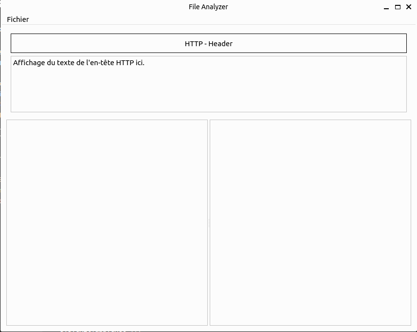
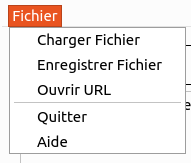
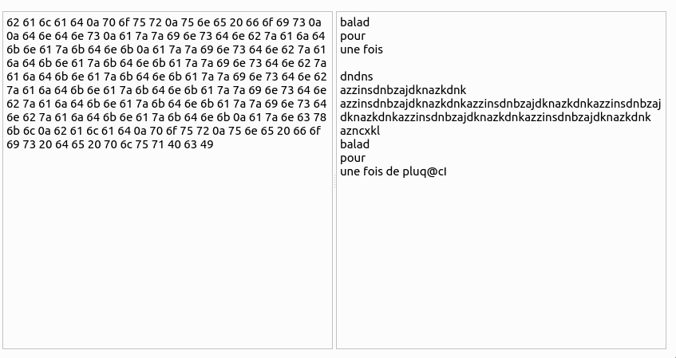
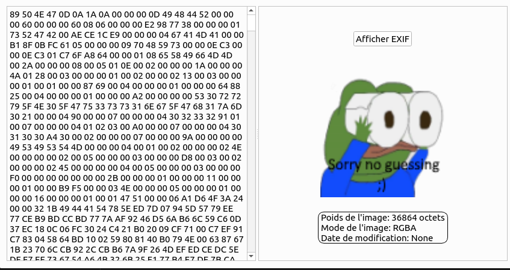
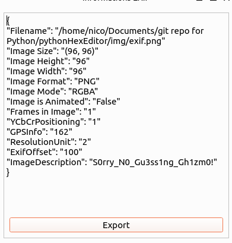
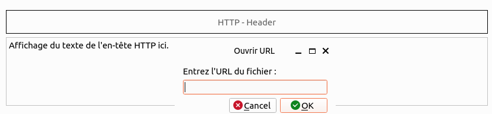
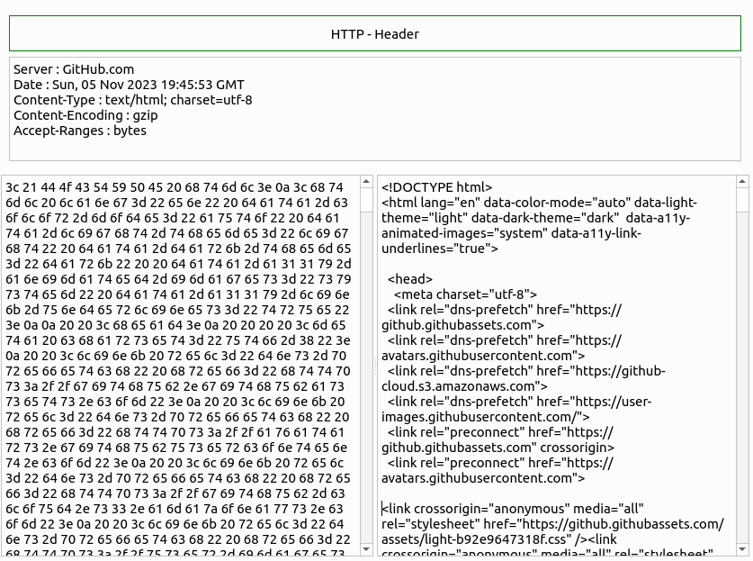

# Python - HexEditor
Bienvenue sur mon application **python HexEditor**  
Cet éditeur hexadécimal vous permettra de visualiser le contenu brute de fichier en hexadécimal. 

Pré-requis:
- Python3

------

### Créer votre environnement venv python
```bash
python3 -m venv venv
source venv/bin/activate
```

Puis installez les dépendances:  
```bash
pip install -r requirements.txt
```

### Visuel de l'interface

Voici l'interface d'accueil:


Lorsque vous cliquez sur le menu **Fichier** en haut à gauche  


Les options de menu:
-   Charger fichier: choisissez un fichier localement pour pouvoir voir ou miodifier ses données.  
-   Enregistrer Ficher: Permet dechoisir où sauvergarder le fichier modifié sous une nouvelle appelation  
-   Ouvrir URL: Cette option permet de récupérer un fichier depuis un URL. L'encadrement de Headers HTTP se colorie en Vert si la réponse du server 200 et se colorie en rouge sinon.  
    De plus, vous aurez les en-têtes HTTP de la réponse dans l'encadrement Juste en dessous de 'HTTP - HEADERS'.  
-   Quitter: Permet de sortir de l'application. Il est possible également d'appuyer sur la croix en haut à droite  

*Remarque*  
Lors du chargement d'un fichier image en local, nous voyons son contenu visible, son poids, sa taille, etc, ... Un bouton **Afficher Exif** permet alors de voir les données exif de l'image.  
Ces données apparaitront dans une nouvelle fenêtre à partir de laquelle vous pourrez cliquer sur le bouton **Export Exif** afin de sauvergarder au format json le contenu exif.  

#### Chargement d'un fichier texte

  
Vous pouvez voir à gauche le ontenu hexadécimale et à droite le contenu brut du fichier.  
Il suffit de modifier d'uin côté ou d'un autre pour que les modifications soient récupercutées de l'autre côté.  

*Remarque*  
Les caractères hexadémaux non reconnu en latin-9 ne seront pas visibles du coté du visualiseur de données brutes.

#### Chargement d'un fichier image



Les informations sur le visualiseur de données brutes nous donne le poids, le mode et la date de modification de l'image.
Vous remarquerez que l'on peut cliquer sur le bouton **Afficher Exif** pour faire apparaître une fenêtre contenant les données exif au format json.

  
Voici la fenêtre qui appairaît. Ces données sont modifiables avant de pouvoir cliquer sur le bouton **Export** qui permettra de sauvegarder les informations localement dans un fichier json par défaut.

#### Chargement d'un fichier depuis un URL



L'action **Ouvrir URL** du menu **Fichier** ouvre une boîte de dialogue dans laquelle vous pourrez rentrer votre URL vers le fichier que vous voulez charger. 

  
Le fichier a bien été chargé depuis un URL. On peut le comfirmer car l'encadrement **HTTP - HEADER** est devenu *vert*.  
Vous remarquerez également que les headers HTTP retourné par le serveur distant sont écrites sous l'encadrement cité. Ces données là sont en Read-Only.